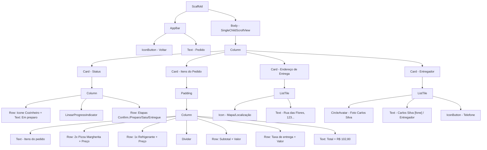

## 1. ##

## 2. Tabela de Componentes e Justificativa de Extração: ##
Decisão sobre quais partes da tela devem ser transformadas em widgets independentes para melhor organização.

Widget Sugerido:      |  Responsabilidade:                                         |   Critério de Extração: 
CardStatusPedido     |   Gerencia a barra de progresso e ícones de etapa.          |    Coesão: Isola a lógica visual do status.
CardItensPedido      |   Lista os produtos comprados e calcula o total.            |    Manutenção: Facilita alterar o layout da lista.
CardEndereco         |   Exibe o local de entrega com ícone.                       |    Reutilização: Pode ser usado na tela de Perfil ou Checkout.
CardEntregador       |   Mostra foto, nome e botão de contato.                     |    Coesão: Separa os dados de terceiros do resto do pedido.

## 3. Análise de StatefulWidget: ##
Se a tela precisasse consultar o servidor a cada 30 segundos para atualizar o status automaticamente, seriam necessários os seguintes ajustes:
Widget Stateful: O widget que contém o corpo da página (Body) precisaria ser um StatefulWidget para gerenciar o estado das atualizações e disparar o "rebuild" da interface.

Campos de Estado:
- statusAtual: Para controlar qual etapa está marcada e o texto de status.
- valorProgresso: Um valor numérico para a barra de carregamento.
- dadosDoEntregador: Para atualizar informações caso o entregador mude.