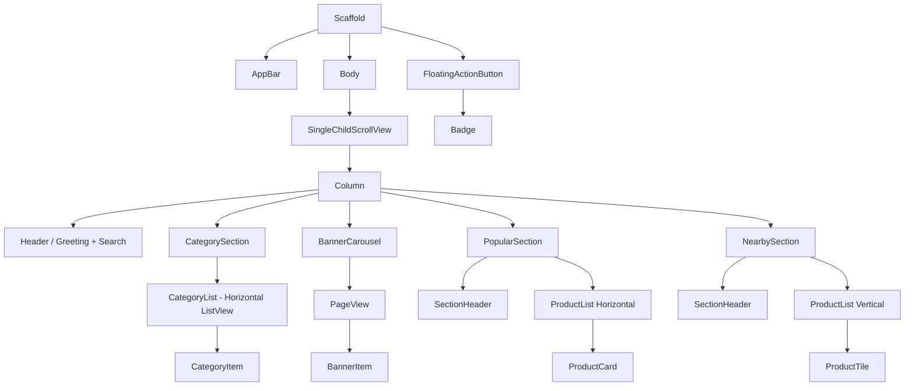

## 1. ##

## 2. ##
| Widget              | Tipo             | Justificativa                                                   |
| ------------------- | ---------------- | --------------------------------------------------------------- |
| CategorySection     | StatelessWidget  | Agrupa título + lista horizontal de categorias                  |
| CategoryItem        | StatelessWidget  | Repetido várias vezes, responsabilidade simples (ícone + texto) |
| BannerCarousel      | StatefulWidget   | Precisa gerenciar estado da página atual (indicador de pontos)  |
| BannerItem          | StatelessWidget  | Cada banner individual é apenas visual                          |
| PopularSection      | StatelessWidget  | Estrutura de seção reutilizável (título + lista)                |
| ProductCard         | StatelessWidget  | Card horizontal reutilizável                                    |
| NearbySection       | StatelessWidget  | Outra seção com mesma ideia estrutural                          |
| ProductTile         | StatelessWidget  | Item vertical simples                                           |
| SectionHeader       | StatelessWidget  | Título + botão "ver todos", reutilizável                        |
| Badge (FAB counter) | StatelessWidget* | Visualmente simples, mas depende de estado global               |

## 3. Gerenciamento de Estado: BannerCarrossel ##
Pergunta: Como o BannerCarrossel precisaria gerenciar seu estado interno?

Resposta: O BannerCarrossel precisa ser um StatefulWidget porque ele possui uma interação que muda o que é exibido na tela. Ele precisaria manter uma variável de estado que seria um exemplo "int _currentPage" para saber qual banner está ativo no momento. Ao deslizar o PageView, um listener atualizaria esse índice através do setState, fazendo com que o Indicador de Pontos mude a cor ou o tamanho para mostrar ao usuário em qual posição ele está.

## 4. Nota sobre o FloatingActionButton (FAB) ##
Conforme solicitado, o Badge no FloatingActionButton que conta os itens no carrinho não deve ser um estado local desta tela. 
Em uma arquitetura real, esse dado viria de um gerenciador de estado global (como Provider, Riverpod ou Bloc), permitindo que qualquer tela do app saiba quantos itens estão no carrinho sem precisar passar dados manualmente entre elas.
